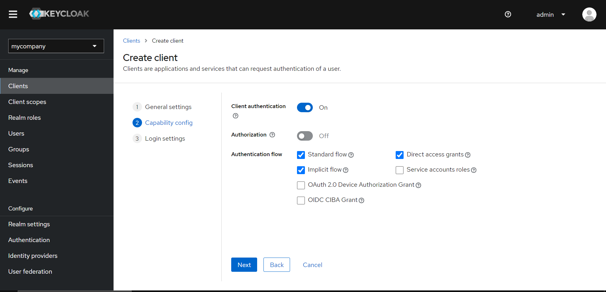

# nextcloud-keycloak-integration

Integration of Nextcloud with Keycloak as an external login using Social Login Connect for secure authentication
This guide assumes that you have already installed both Keycloak and Nextcloud. The following steps will help you integrate Nextcloud with Keycloak as an external login provider using the OpenID Connect protocol.

### Prerequisites

- Keycloak is installed and how to download keycloak visit [Keycloak URL](https://www.keycloak.org/documentation)
- Nextcloud is installed and running at [Nextcloud URL](https://docs.nextcloud.com/server/latest/admin_manual/installation/)
- Admin access to both Keycloak and Nextcloud

---

## Step 1: Configure Keycloak

### 1.1. Create a Realm

1. Log into Keycloak's Admin Console.

2. On the left sidebar, click on **Realms** and select **Add Realm**.
3. Enter the **Realm Name** (e.g., `company name`) and click **Create**.

### 1.2. Create a Client for Nextcloud

1. In the **nextcloud** realm, go to **Clients** from the left sidebar and click on **Create**.

2. Enter the following details:

- **Client ID**: `my-nextcloud` (give any name)
  
- **Client Protocol**: OpenID Connect
- **client authentication**: On
- **Implicit flow**: On
  

- **Root URL**: `your nextcloud url` (eg https://fms.company.com)
- **Valid redirect URIs**: `(eg https://fms.company.com/*)`
- **Web Origins**: `your nextcloud url`
  

3. Click **Save**.

### 1.3. Create Client Credentials

1. Go to the **Credentials** tab of the client.
2. Copy the **Client Secret** as you'll need it for the Nextcloud configuration.

## Step 2: Configure Nextcloud

### 2.1. Enable the Social Login App

1. Log into Nextcloud as an admin.
   
2. Click on the Profile Icon then Go to **Apps** and search for "**Social Login.**"

3. Download & Enable the **Social Login** application.
   
   on your case it should say Download and enable.

### 2.2. Configure SocialLogin in Nextcloud

1. After enabling the app, go to **Administration Settings** > **Social Login**.
   you should this a ui something similar to this
   

2. Adjust the settings as your need to connect with keycloak add the plug button on **Custom ID connect**:
   
3. Save the settings.
