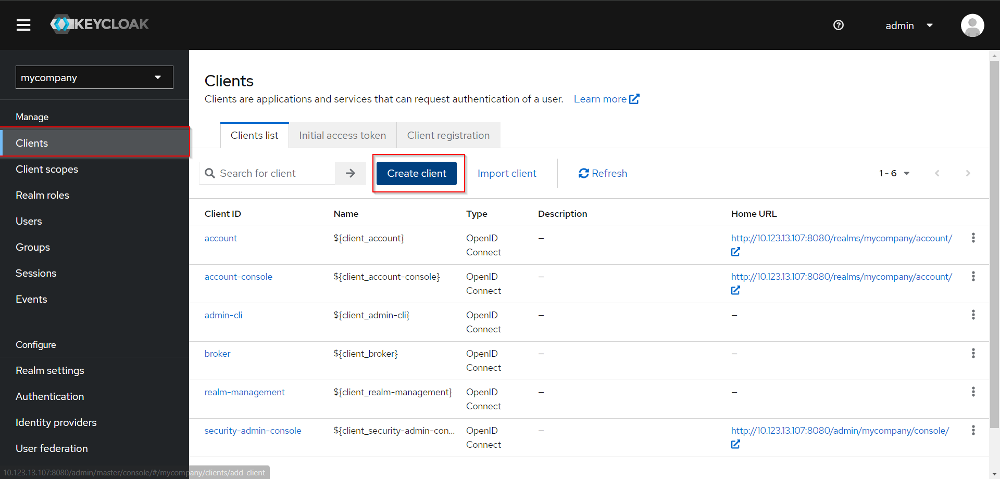
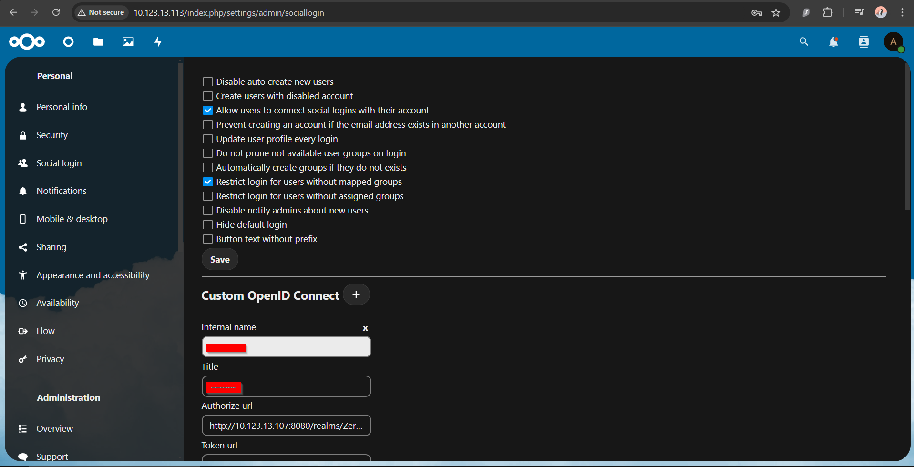

# nextcloud-keycloak-integration

Integration of Nextcloud with Keycloak as an external login using Social Login Connect for secure authentication
This guide assumes that you have already installed both Keycloak and Nextcloud. The following steps will help you integrate Nextcloud with Keycloak as an external login provider using the OpenID Connect protocol.

### Prerequisites

- Keycloak is installed and how to download keycloak visit [Keycloak URL](https://www.keycloak.org/documentation)
- Nextcloud is installed and running at [Nextcloud URL](https://docs.nextcloud.com/server/latest/admin_manual/installation/)
- Admin access to both Keycloak and Nextcloud

---

## Step 1: Configure Keycloak

### 1.1. Create a Realm

1. Log into Keycloak's Admin Console.

2. On the left sidebar, click on **Realms** and select **Add Realm**.
3. Enter the **Realm Name** (e.g., `company name`) and click **Create**.

### 1.2. Create a Client for Nextcloud

1. In the **nextcloud** realm, go to **Clients** from the left sidebar and click on **Create**.

2. Enter the following details:

- **Client ID**: `my-nextcloud` (give any name)
  
- **Client Protocol**: OpenID Connect
- **client authentication**: On
- **Implicit flow**: On
  

- **Root URL**: `your nextcloud url` (eg https://fms.company.com)
- **Valid redirect URIs**: `(eg https://fms.company.com/*)`
- **Web Origins**: `your nextcloud url`
  

3. Click **Save**.

### 1.3. Create Client Credentials

1. Go to the **Credentials** tab of the client.
2. Copy the **Client Secret** as you'll need it for the Nextcloud configuration.

## Step 2: Configure Nextcloud

### 2.1. Enable the Social Login App

1. Log into Nextcloud as an admin.
   
2. Click on the Profile Icon then Go to **Apps** and search for "**Social Login.**"

3. Download & Enable the **Social Login** application.
   
   on your case it should say Download and enable.

### 2.2. Configure Social Login in Nextcloud

1. After enabling the app, navigate to **Administration Settings** > **Social Login**. You should see a UI similar to this:
   

2. Adjust the settings as needed to connect with Keycloak. Add the **Custom OpenID Connect** option by clicking the **plug** button:
   

### 2.2.1 Retrieve Details from Keycloak

1. Go back to Keycloak and click on **Realm Settings**:
   

2. Select **OpenID Endpoint Configuration**. This will redirect you to an API page containing various configuration details.

3. Copy the relevant information from the OpenID Connect endpoint and paste it into the corresponding fields in Nextcloud’s OpenID Connect settings.

### 2.2.2 Configure OpenID Connect in Nextcloud

When configuring the OpenID Connect settings in Nextcloud, you will need the following details from Keycloak:

1. **Authorize URL**: This is the `authorization_endpoint` from Keycloak’s OpenID Endpoint Configuration. Copy the URL and paste it into the **Authorize URL** field in Nextcloud.

2. **Token URL**: This is the `token_endpoint` from Keycloak’s OpenID Endpoint Configuration. Copy the URL and paste it into the **Token URL** field in Nextcloud.

3. **Title**: This is the text that will appear on the login button (e.g., "Login with Keycloak"). You can enter any name you prefer here.

4. **Client Secret**:
   - Go back to Keycloak.
   - Click on **Clients** from the left sidebar.
   - Select the client you created for Nextcloud (e.g., `nextcloud`).
   - Go to the **Credentials** tab.
   - Copy the **Client Secret** and paste it into the **Client Secret** field in Nextcloud.

After completing these steps, save the settings in Nextcloud.

### 2.3 Test and Create a Keycloak User

1. **Log out** of Nextcloud.
2. On the login page, you should now see a button that says **Login with Keycloak**.
   
3. Click the button, but since there are no users in Keycloak yet, you won’t be able to log in.

### 2.3.1 Create a User in Keycloak

1. Go back to the **Keycloak Admin Console**.
2. In the left sidebar, click on **Users**.
3. Click the **Add User** button.
4. Fill in the following fields:
   - **Username**: Enter a unique username.
   - **Email**: (Optional) Enter an email address.
   - **First Name**: Enter the user’s first name.
   - **Last Name**: Enter the user’s last name.
5. Click **Save**.

### 2.3.2 Set the User's Credentials

1. After creating the user, go to the **Credentials** tab.
2. Set a password for the user by entering it into the **New Password** and **Confirm Password** fields.
3. Disable the **Temporary** option to allow the user to keep the password permanently.
4. Click **Set Password**.

Now the user is created, and you should be able to log in to Nextcloud using Keycloak.
